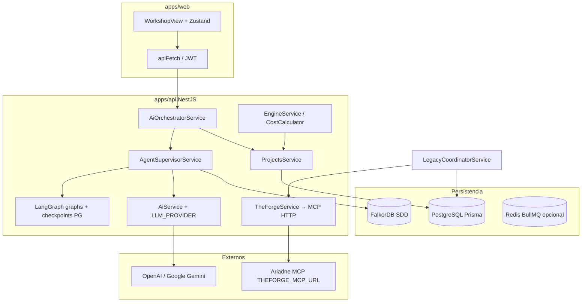
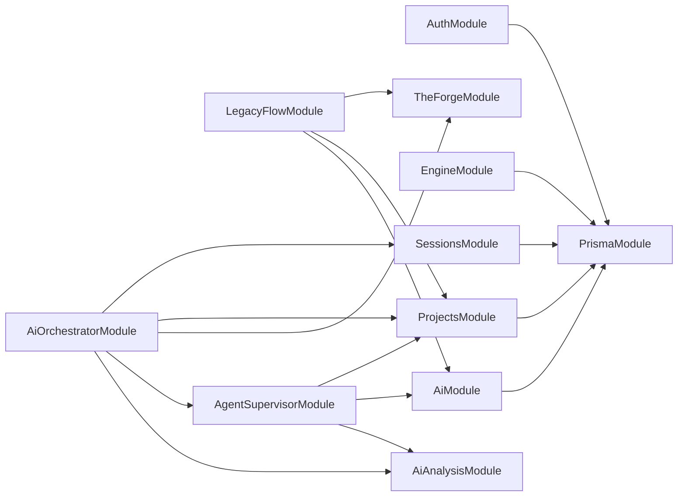

# The Forge — Knowledge Base (NotebookLM / PROJECT_BRAIN_DUMP)

> **Propósito:** Documento maestro para cuadernos de estudio (p. ej. NotebookLM). Describe el monorepo **theforge** tal como está en el código y en `docs/` a marzo 2026.  
> **No confundir:** Este repo es **The Forge** (Software Factory: entrevista → MDD → semáforo → estimación). No es el producto “Google Antigravity”; la IA agéntica usa **LangChain / LangGraph** y orquestación propia (`AgentSupervisor`), con LLMs **OpenAI** o **Google Gemini** vía adapters.

---

## 1. Executive Summary

**The Forge** es una aplicación **Specification-Driven Development (SDD)** que guía un proyecto desde una **entrevista proactiva con IA** hasta un **Master Design Document (MDD)** de 7 secciones canónicas, un **semáforo** de calidad (ROJO / AMARILLO / VERDE), **estimación de coste en MXN** y generación de **entregables** (Spec, Blueprint, contratos API, flujos, infra, tasks, etc.).

- **Frontend:** React 18 + Vite 6 + Tailwind 3, estado con Zustand, UI estilo Kreo (tokens luxury/dorado).
- **Backend:** NestJS 10, Prisma 5 + PostgreSQL, grafo documental en **FalkorDB** (Cypher), colas **BullMQ** opcionales vía Redis, integración **HTTP JSON-RPC** con MCP externo **AriadneSpecs / TheForge** para código indexado (`THEFORGE_MCP_URL`).
- **IA:** Patrón **strategy** (`LLMProvider`: OpenAIAdapter / GeminiAdapter); **LangGraph** para grafos de agentes; **AgentSupervisor** como capa de orquestación del chat y la etapa (`Stage`).

**Fuentes canónicas en repo:** `docs/THEFORGE-INDEX.md`, `docs/MCP-ARQUITECTURA-THEFORGE.md`, `docs/STAGE-SDD.md`, `blueprint.md`, `.cursor/skills/theforge/SKILL.md`.

---

## 2. Deep Dive Arquitectónico

### 2.1 Patrón de diseño

| Capa | Patrón / estilo |
|------|------------------|
| API | **Modular monolith (NestJS)**: módulos por dominio, **DI** de Nest, guards/interceptors globales (`JwtAuthGuard`, `UserContextInterceptor`). |
| IA | **Ports & Adapters**: interfaz `LLMProvider` en `modules/ai/interfaces/`; únicas implementaciones en `modules/ai/adapters/`. Factory `createLLMProvider()` según `AI_PROVIDER`. |
| Datos relacionales | **Repository vía PrismaService**; modelos `User`, `Project`, `Stage`, `Session`, `Estimation`, `EpisodicMemory`. |
| Grafo SDD | **FalkorDB** como backend de grafo embebido (Redis-compatible): nodos de documento/entidades por **stage**, no mezclar con el índice de código del MCP. |
| Legacy / código | **TheForgeService** cliente HTTP al MCP ajeno; **LegacyCoordinatorService** orquesta flujo legacy + documentación de partida. |

No es hexagonal puro con puertos explícitos en todos los módulos; es un **Nest modular** con disciplina fuerte en la capa IA (adapters) y contratos en `packages/shared-types`.

### 2.2 Estructura de carpetas (relevante)

```
theforge/
├── apps/
│   ├── api/                 # NestJS — orquestador, IA, proyectos, MCP cliente
│   │   └── src/
│   │       ├── app.module.ts
│   │       ├── modules/     # auth, ai, engine, projects, sessions,
│   │       │                 # ai-orchestrator, agent-supervisor, ai-analysis,
│   │       │                 # theforge, legacy-flow, scraper
│   │       ├── prisma/
│   │       └── common/
│   └── web/                 # React + Vite — Workshop, lista proyectos, OTP
├── packages/
│   ├── database/            # schema.prisma, migraciones
│   ├── shared-types/       # Zod/DTOs compartidos
│   └── config/              # tsconfig, eslint, tailwind base
├── docs/                    # THEFORGE-INDEX, MCP, STAGE-SDD, validación SDD
├── docker-compose.yml       # db, redis cola, falkor-sdd, api, web
└── turbo.json
```

### 2.3 Flujo de datos principal (mermaid)



**Chat workshop:** `POST /ai-orchestrator/chat` (y rutas relacionadas) → orquestador → supervisor → herramientas (incl. ingesta MDD a Falkor, herramientas de grafo SDD) → respuesta al cliente.

### 2.4 Tres “cerebros” que NotebookLM no debe mezclar

1. **PostgreSQL + Prisma:** estado durable del producto (usuario, proyecto, etapas, sesiones, MDD por etapa aplanado al API para compatibilidad).
2. **FalkorDB (grafo SDD):** vista estructurada del MDD y entidades por `stageId` — consultas Cypher de solo lectura / herramientas de agente.
3. **MCP TheForge (Ariadne):** índice del **código fuente** del cliente; UUID `theforgeProjectId` (proyecto o `roots[].id`). **No** es la misma base que Falkor SDD.

---

## 3. Stack Tecnológico (versiones declaradas en package.json)

| Área | Paquete / runtime | Versión (aprox.) |
|------|-------------------|-------------------|
| Monorepo | pnpm | 9.14.2 |
| Build | turbo | ^2.3.0 |
| Runtime Node | engines | >=20 |
| API framework | @nestjs/* | ^10.4.x |
| ORM | prisma / @prisma/client | ^5.22.0 |
| HTTP API | express (Nest) | ^5.2.1 |
| Colas | bullmq | ^5.71.1 |
| Grafo SDD | falkordb | ^6.6.0 |
| IA – OpenAI | openai | ^4.73.0 |
| IA – Google | @google/generative-ai | ^0.21.0 |
| IA – orquestación | @langchain/langgraph, checkpoint postgres | ^0.2.x / ^1.0.0 |
| Validación / tipos | zod | ^3.23.8 |
| Web | react / react-dom | ^18.3.1 |
| Web build | vite | ^6.0.3 |
| Web estado | zustand | ^5.0.10 |
| Markdown UI | react-markdown, mermaid | ^10.x / ^11.x |
| Estilos | tailwindcss | ^3.4.15 |

**Servicios externos:** MCP Ariadne (HTTPS JSON-RPC); proveedores LLM (OpenAI / Google); opcional Tavily (`@langchain/tavily`); email OTP (nodemailer + `EMAIL_OTP`).

**No hay “Google Antigravity” como dependencia** en este repositorio; si un documento externo lo menciona, aquí el paralelo es **Gemini + LangChain + Cursor**.

---

## 4. Inventario de Funcionalidades

| Funcionalidad | Archivos / módulos clave | Lógica principal |
|---------------|--------------------------|------------------|
| Autenticación OTP + JWT | `modules/auth/` | OTP por email; JWT; `JwtAuthGuard` global. |
| Proyectos CRUD + entregables | `modules/projects/` | `Project`, campos de documentos; etapas `Stage`; cascadas de generación. |
| Sesiones / chat log | `modules/sessions/` | Persistencia `Session.chatLog`, `contextStep`. |
| LLM unificado | `modules/ai/` (`ai.factory`, `adapters/*`, `ai.service`) | `AI_PROVIDER` → OpenAI o Gemini; sin imports de SDK fuera de `adapters/`. |
| Motor semáforo / checklist | `modules/engine/` (+ uso desde proyectos/orquestador) | Derivación ROJO/AMARILLO/VERDE desde estructura MDD (entidades, business_core, edge_cases…). |
| Estimación MXN | `modules/engine/cost-calculator.service.ts`, `apps/web/src/utils/costCalculator.ts` | Horas: entidades×12 + pantallas×16 + endpoints×4; multiplicadores `TechnicalMetadata`; buffer 1.25 si status ≠ VERDE; **total MXN horas × 1050** en servicio alineado con front. Tarifas por rol en front (`RATES_MXN`) para **vista** de equipo. |
| Orquestador chat | `modules/ai-orchestrator/` | Entrada HTTP del workshop; delega en supervisor. |
| Supervisor agéntico | `modules/agent-supervisor/` | Enrutado por etapa; ingest MDD a Falkor; herramientas; evaluador legacy opcional (`AGENT_EVALUATOR_LEGACY`). |
| Análisis / ADRs / hilos | `modules/ai-analysis/` | Hilos MDD, ADRs persistidos, rutas de análisis. |
| Cliente MCP TheForge | `modules/theforge/theforge.service.ts`, `theforge-evidence-context.util.ts` | `tools/call` (list_known_projects, ask_codebase, semantic_search, get_file_content, …); `DEBUG_MCP=1` loguea request/response. |
| Flujo legacy | `modules/legacy-flow/` | `generateCodebaseDoc`, `start`, MDD de cambio, entregables; `legacyAnalyzerIndicatesEmptyIndex` evita persistir texto “sin datos en índice” y fuerza fallback clásico. |
| Scraper / URLs | `modules/scraper/` | Guard SSRF (`ip-range-check`), Cheerio. |
| Workshop UI | `apps/web/src/views/WorkshopView.tsx`, `store/workshopStore.ts` | Tres columnas desktop; móvil tabs Chat/Docs/Estado; semáforo y costos; tabs de documentos. |
| Lista proyectos + TheForge modal | `apps/web/src/App.tsx` | Crear NEW/LEGACY; modal proyectos/repos MCP. |

---

## 5. Grafo de Dependencias (servicios Nest — comunicación lógica)



**Dependencias npm internas:** `apps/api` depende de `@theforge/database` y `@theforge/shared-types`. `apps/web` consume API vía HTTP (no importa workspace de API).

---

## 6. Lógica de Negocio Crítica (reglas embebidas)

1. **MDD de 7 secciones:** Orden y semántica acotan semáforo y flujos (ver `docs/THEFORGE-INDEX.md` §4 y `ENTREGABLES-SDD-VALIDACION.md`).
2. **Semáforo:** ROJO si faltan entidades o `business_core`; AMARILLO con gaps; VERDE checklist completo (~95% precisión según reglas del engine).
3. **Generar entregables en cascada:** Condicionado a complejidad (`LOW` / `MEDIUM` / `HIGH`) y a semáforo VERDE donde aplica; LEGACY tiene caminos alternos (codebase doc, ingeniería inversa).
4. **IA agnóstica:** Ningún servicio de negocio debe importar `openai` o `@google/generative-ai` directamente.
5. **Conformance:** Blueprint debe alinearse con MDD §3 para desbloquear generación de API en UI (lógica en flujo legacy + conformance service).
6. **Coste:** Fórmula y constantes compartidas conceptualmente entre `cost-calculator.service.ts` y `costCalculator.ts`; alterar solo con acuerdo explícito (regla de arquitectura).

---

## 7. Puntos de Extensión y Refactorización

- **Duplicación documentación vs código:** `docs/THEFORGE-INDEX.md` §6.1 menciona compose “sin Redis BullMQ”; el `docker-compose.yml` actual incluye **theforge-redis-queue** — conviene **alinear docs** con el stack real.
- **Índice THE-FORGE vs THEFORGE:** Algunos paths históricos (`THE-FORGE-INDEX` eliminado o renombrado a `THEFORGE-INDEX.md`); buscar referencias rotas.
- **Agentic AI:** LangGraph + checkpoints en Postgres; complejidad alta — candidato a diagramas de secuencia por “tipo de mensaje” y tests de contrato en rutas críticas.
- **MCP:** Contrato evoluciona (`theforge-mcp-tools-alignment.spec.ts`); mantener `THEFORGE_MCP_CLIENT_ARG_KEYS` sincronizado.
- **NotebookLM:** Cualquier afirmación sobre “Antigravity” debe contrastarse con este archivo: aquí las herramientas son **LangChain/LangGraph + adapters OpenAI/Gemini + MCP HTTP**.

---

## 8. Preguntas Abiertas (para debatir con NotebookLM)

1. ¿Conviene extraer **puertos explícitos** (interfaces) para `ProjectsService` y `TheForgeService` y testear el orquestador con dobles, o el coste es demasiado alto para el tamaño del equipo?
2. ¿El **modelo de coste** debería unificar una sola fuente de verdad (p. ej. paquete `shared`) para backend + frontend y eliminar divergencias futuras con `RATES_MXN` vs `RATE_MXN_PER_HOUR`?
3. **Escala:** ¿BullMQ + Redis como obligatorio en todos los despliegues o mantener modo síncrono para instalaciones pequeñas?
4. **Seguridad MCP:** ¿Auditoría sistemática de prompts y de datos enviados en `DEBUG_MCP=1` en entornos compartidos?
5. **Multi-tenant:** El modelo actual es por `userId` en `Project`; ¿hay límites de aislamiento pensados para SaaS multi-org?

---

## 9. Referencias rápidas de archivos

| Tema | Ruta |
|------|------|
| Entrada Nest | `apps/api/src/main.ts`, `app.module.ts` |
| Chat HTTP | `apps/api/src/modules/ai-orchestrator/` |
| Supervisor | `apps/api/src/modules/agent-supervisor/` |
| Prisma schema | `packages/database/schema.prisma` |
| Cliente MCP | `apps/api/src/modules/theforge/theforge.service.ts` |
| Legacy | `apps/api/src/modules/legacy-flow/legacy-coordinator.service.ts` |
| Workshop | `apps/web/src/views/WorkshopView.tsx`, `apps/web/src/store/workshopStore.ts` |
| Índice arquitectura | `docs/THEFORGE-INDEX.md` |
| Docker | `docker-compose.yml`, `.env.example` |

---

*Generado como volcado estructurado para ingestión en NotebookLM. Última revisión según árbol de código del monorepo **theforge**.*
