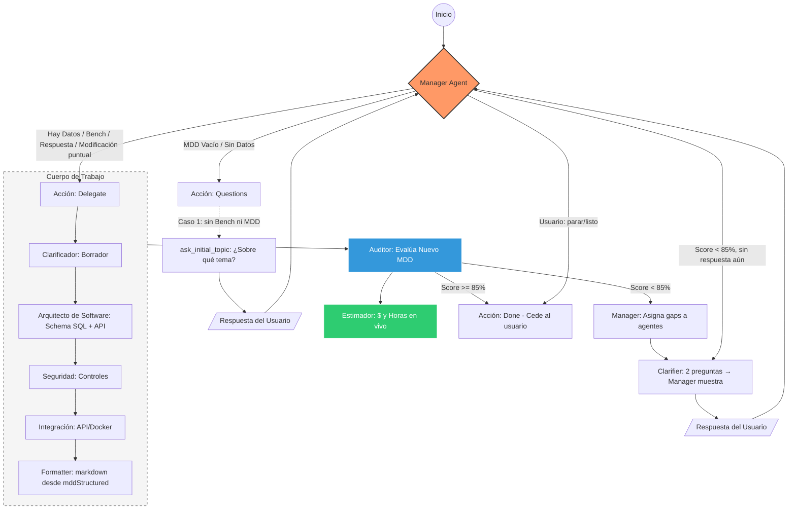

# AiAnalysisModule

Módulo de análisis agentic para **Domain Benchmark & Gap Analysis (DBGA)**. Orquesta agentes especializados (LangGraph) para investigar, scrapear y sintetizar datos de mercado a partir de una idea de usuario.

## Estructura

- **state/** – Estado compartido LangGraph (tipado estricto)
  - `dbga-state.schema.ts` – Schemas Zod y tipos: `CompetitorData`, `DBGAStatus`, `DBGAState`
  - `langgraph-state.annotation.ts` – Anotación LangGraph `DBGAStateAnnotation` para `StateGraph`
  - `index.ts` – Re-export
- **llm/** – `create-dbga-llm.ts` – Runtime BYOK/tenant del usuario (`resolveRuntime`). `createMddAuditorLLM` usa `resolveAuditorRuntime` (instancia activa, con `auditorChatModel` opcional en la instancia).
- **graph/** – `dbga-graph.ts` – StateGraph compilado; edges Scout → Auditor → Critic → (Scout | Synthesis) → END
- **nodes/** – Nodos por agente: Scout (con tools), Auditor (con tools), Critic, Synthesis
- **tools/** – ToolRegistry e integración externa
  - `tool-registry.ts` – `getScoutTools()` (Tavily + scrape_url), `getAuditorTools()` (scrape_url), `getAgenticRagToolset()` (SDD: Cypher lectura + supervisor + patch secciones + `propose_mdd_amendment`; TheForge legacy opcional)
  - `graph-memory/graph-memory.service.ts` – ingesta SDD por **Stage**: nodos `Stage`, `MDD_Section`, `DB_Entity`, `API_Endpoint`, relaciones `CONSUMES` / `IMPLEMENTS` (vía `syncMddToGraph` + `activeStageId` en el estado MDD)
  - `agent-sdd-tools.ts` – `query_sdd_graph` (Cypher lectura), `patch_mdd_section` (secciones 1–7)
  - `agent-theforge-tools.ts` – `ask_codebase`, `get_modification_plan`, `get_c4_model`, `validate_before_edit`, `get_file_content`, `get_legacy_impact`, … (fijadas a `theforgeProjectId`); subconjunto **Arquitecto MDD** (`getMddArchitectTheForgeTools`): `get_c4_model`, `get_contract_specs`, `get_legacy_impact`
  - `tavily.tool.ts` – Búsqueda web para Scout (`TAVILY_API_KEY`)
  - `scrape-cheerio.tool.ts` – Scrape URL → markdown + metadata (Cheerio + fetch; sin API key)
- **prompts/** – Prompts por dominio: `benchmark/` (scout, auditor, critic, synthesis), `mdd/` (clarifier, security-architect, integration-engineer, auditor; **esqueleto constitución YAGNI:** `prompts/mdd/mdd-constitution-skeleton.md` + `prompts/mdd/README.md`); `load-prompts.ts` carga desde subcarpetas (`MDD_CONSTITUTION_SKELETON_MARKDOWN`)
- **utils/** – Utilidades compartidas: `parse-json.ts` (`parseJsonOrThrow`) usada por nodos MDD; homologable con Benchmark sin cambiar su comportamiento
- **ai-analysis.service.ts** – Orquestación; `startAnalysis(idea)` invoca el grafo; `streamAnalysis(idea, projectId)` emite progreso + markdown final y, si hay `projectId`, **inferencia LLM de `complexity`** (`DiscoveryService.inferComplexity`) + `PATCH` del proyecto antes del evento `done`.
- **estimation/** – Estimación en vivo independiente del flujo de agentes
  - `estimation.types.ts` – `MDDReference`, `MDDContext`, `LiveMetricsResult` (`roles` / `rolesHours` dinámicos, `readinessHints` para UI Workshop), `PrecisionBreakdown` (con `sectionStatus` opcional para "Estado Inconsistente"), tarifas y umbrales (Rojo &lt;50%, Amarillo 51–94%, Verde 95%+)
  - `estimation.service.ts` – métricas en vivo; **trazabilidad BRD→MDD** (`consistency.util.ts` busca capacidades/UAT del BRD en §1/§4/§5 del MDD); hints separados `mddReadinessHints` vs `traceabilityHints`; snapshot en `Stage.shortTermContext.mddAuditSnapshot`.
- **ai-analysis.controller.ts** – `GET /ai-analysis/estimation?projectId=` y opcional `&stageId=` (MDD de esa etapa; sin param, etapa primaria); `POST /ai-analysis/estimation` body puede incluir `stageId`; `clear-draft` igual. `POST /ai-analysis/start` con body `{ idea, projectId? }`; `POST /ai-analysis/stream` (DBGA); `GET /ai-analysis/mdd/thread?projectId=&stageId=` — `threadId` del Manager por etapa (`AgentStateCheckpoint` único por `projectId` + `mddStageId`). `POST /ai-analysis/mdd/stream` body opcional `stageId` (borrador en vivo / checkpoint alineados a la etapa); `mdd/stream/manager` y `mdd/stream/regenerate-section` igual; `mdd/stream/resume` resuelve etapa desde el checkpoint. **`mdd/stream/manager`** y **`mdd/stream/resume`** aceptan `images` (mismo formato que chat: `parseChatImageAttachments`); el servicio fusiona visión vía `AiService.describeImagesForMddPipeline` en `lastUserMessage`. NDJSON: `progress` / `done` / `error`
- **state/state-to-markdown.ts** – `stateToMarkdown(state)` genera el documento markdown final del DBGA; `getAgentLabel(nodeName, context?)` para etiquetas de agentes DBGA y MDD
- **graph-memory/** – FalkorDB (`FALKORDB_SDD_URL`): `graph-memory.service.ts` (`syncMddToGraph`, `evaluateSddDependencyHealth` vía Cypher, `querySddGraphReadOnly`); `graph-memory.module.ts` exporta el servicio para `EngineModule` / pipeline de MDD sin ciclo con `ProjectsModule`
- **sdd-ingestor.service.ts** – Parsea MDD markdown → estructurado y sincroniza el grafo (lo dispara `AiOrchestratorService` tras chat/stream si el MDD cambió)
- **ai-analysis.module.ts** – Módulo NestJS

## Flujo MDD (Master Design Document)

El MDD generado actúa como **Constitución del proyecto** (SDD): gobierna los entregables (Blueprint, Contratos, Infra) y debe ser validado contra ellos (checklist de cumplimiento en prompts).

Pipeline de 4 agentes LangGraph para generar el MDD a partir del Benchmark & Gap Analysis:

- **state/** – `mdd-state.schema.ts`, `mdd-state.annotation.ts`, `mdd-structured.schema.ts` – Estado: `dbgaContent`, `clarifiedScope`, `mddStructured`, `mddDraft`, `auditorScore`, `auditorFeedback`, `auditorGaps` (gaps estructurados del Auditor LLM: score, status, critical_gaps, syntax_errors, infrastructure_ready; en español), `auditorDecision`, `mddIteration`, `lastStepFailed`, `mddPlan`, …
- **graph/mdd-graph.ts** – Grafo: Manager → (Clarifier | ask_initial_topic | **primer nodo de sectionsToRun**) → … → Auditor → Manager. **Orquestación:** (1) Usuario pide solo "contexto y alcance" → `delegateTarget=clarifier_only`; tras Clarifier, **merge_section1_only** → END. (2) Usuario describe una **necesidad** en lenguaje de dominio (ej. "nos falta una pantalla para dar de alta X") → el Manager infiere qué agentes están afectados y setea `delegateTarget=sections`, `sectionsToRun=[software_architect, security, ...]`; solo se ejecutan esos nodos en orden, luego format → diagram → auditor → manager. (3) Pipeline completo → Clarifier → … → Auditor → Manager. Redactor eliminado; documento unificado por merge de slices en `mddStructured` y render con `mddStructuredToMarkdown`. **Diagram Injector**: si hay `mddStructured.modeloDatos.sql` sin `diagramaEr`, genera erDiagram desde SQL e **inyecta solo el bloque en §3 del draft** (no reconstruye el documento desde structured, para no pisar §3). Si no hay structured, opera sobre `mddDraft` (suggestMddDiagrams + injectMddDiagrams). **Manager**: (1) "reformatea el documento" → si hay `mddStructured`, re-render con `mddStructuredToMarkdown`; si no, normalizeMddFormat; (2) "regenera el diagrama ER" → regenerateErDiagramFromSql y termina (sin LLM).
- **Debug §3:** Si `DEBUG_MDD_SECTION3=1` (o `true`), en consola se loguea el cuerpo de §3 (longitud, tablas CREATE TABLE, preview) tras el Software Architect y al emitir el evento "done", para comparar y localizar dónde se pierde contenido.
- **nodes/** – … **`mdd-formatter.node.ts`**, **`mdd-merge-section1.node.ts`** (fusiona solo sección 1 cuando `delegateTarget=clarifier_only`), **`mdd-diagram-injector.node.ts`** (sugiere e inyecta diagramas Mermaid según contenido), …
- **utils/mdd-diagram-suggestions.ts** – `suggestMddDiagrams(draft)` (reglas: CREATE TABLE → erDiagram; login/auth → stateDiagram-v2; componentes frontend → flowchart), `injectMddDiagrams(draft, suggestions)`. **tools/mdd-tools.ts** – `suggest_mdd_diagrams` (tool para agentes que quieran consultar sugerencias).
- **prompts/mdd/** – `manager-prompt.md`, `clarifier-prompt.md`, `clarifier-questions-only-prompt.md`, `software-architect-prompt.md`, `security-architect-prompt.md`, `integration-engineer-prompt.md`, `auditor-prompt.md`. (Frontend: cubierto por software_architect en §2; `frontend-architect-prompt.md` existe pero el nodo ya no está en el pipeline.) **render/** – `mdd-structured-to-markdown.ts`: única fuente de markdown desde `mddStructured` (json2md). **utils/** – `mdd-merge-structured.ts` (merge de slices), `mdd-markdown-to-structured.ts` (opcional: checkpoints viejos).

### Diagrama del flujo (con Manager)

**Notas de implementación:**

- **Estimador** no es un nodo del grafo: es `EstimationService` (setLiveDraft/setAuditorGaps en cada paso del stream; `calculateLiveMetrics` para semáforo). La **complejidad del proyecto** (`Project.complexity` → `state.mddComplexity`, caché `cacheProjectComplexity` por `projectId`/`stageId`) relaja penalizaciones regex y el desglose (`adjustGapsForEstimationComplexity`) en LOW/MEDIUM; en HIGH el verde con gaps del Auditor sigue exigiendo `infrastructure_ready`. Apéndices en prompts: `utils/mdd-complexity-rigor.ts` (Clarificador, Arquitecto, Auditor; sintetizador §1 en regeneración). Los **gaps** los genera el **Auditor (LLM)** en JSON estructurado (`critical_gaps`, `syntax_errors`, `infrastructure_ready`); se guardan en `state.auditorGaps` y en el estimador por proyecto. Si el Auditor no devuelve esa estructura, se usa fallback por regex y `getGapsReport(md)`. Si precisión &lt; 85%, el Manager asigna los gaps a los agentes; a partir de 85% se cede la intervención al usuario.
- **Caso 1:** sin Bench ni MDD → Manager va a `ask_initial_topic` (una pregunta); al responder, el usuario va de nuevo al Manager y este delega a Clarifier.
- **Modificación puntual:** si el usuario escribe algo como "cambia X por Y" o "añade endpoint Z", el Manager delega directo a Clarifier (sin pedir 2 preguntas).

- **Flujo con Manager (Entrevistador de Estados):** `createMddGraphWithManager(checkpointer)` – Manager no es pasapapeles. **Caso 1 (Inicio):** sin Bench ni MDD → Manager NO delega; nodo `ask_initial_topic` pregunta "¿Sobre qué tema o problema necesitas el MDD?"; al responder → Clarifier → Security → Integration → Auditor → Manager; si score < 85% → Manager asigna gaps a agentes (Clarifier/preguntas); >= 85% se cede al usuario. **Caso 2 (Refinamiento):** score < 85% → Manager asigna tareas de corrección a agentes según critical_gaps. **Caso 3 (Benchmark):** existe dbgaContent → delegar a especialistas. **Done** cuando Auditor >= 85% o usuario pide parar (umbral 85 = ceder intervención al usuario). EstimationService (setLiveDraft) se llama en cada iteración del stream para actualizar costo en la UI. `POST /ai-analysis/mdd/stream/manager`, `POST /ai-analysis/mdd/stream/resume`.
- **Comandos / en el chat (solo tab MDD):** El usuario puede escribir `/` para ver la lista de secciones del MDD y elegir regenerar **solo esa sección** (el resto del documento se usa como contexto). Backend: `POST /ai-analysis/mdd/stream/regenerate-section` con `{ projectId, section: 1–7, mddContent? }`. §1 → solo agente **sintetizador de contexto** (regenera §1 desde §2–§7, sin ejecutar Clarifier ni el resto del grafo); 2–5 → Software Architect; 6 → Security; 7 → Integration. El mensaje no es obligatorio que sea un comando: si escribe texto normal (ej. rutas `/api/v1`) se envía al Manager con normalidad.
- **Servicio** – `streamMddAnalysis(dbgaContent, projectId?, stageId?)` emite progreso por nodo y al final `done` con el markdown del MDD. Usa `recursionLimit` (default 25; `LANGGRAPH_RECURSION_LIMIT` en env, 10–500). Máx 2 ciclos de refinamiento (`MAX_MDD_ITERATIONS=2`) para no cortar el grafo MDD. El grafo compila con `TheForgeService` para que el **Arquitecto** en proyectos legacy (`isLegacyProject` + `theforgeProjectId`) reciba `get_contract_specs` y `get_legacy_impact` además de `format_section3_endpoints`. Durante el stream actualiza `EstimationService.setLiveDraft(projectId, mddDraft, stageId)` (clave por etapa) para que la UI pueda consumir métricas en vivo vía `GET /ai-analysis/estimation?projectId=&stageId=`.
- **Frontend** – En Paso 0 (Benchmark), botón "Generar MDD con agentes" llama a `POST /ai-analysis/mdd/stream` con `dbgaContent`, muestra progreso en el chat y persiste el resultado en `mddContent`. La columna derecha (Semáforo + Estimación MXN) consume `GET /ai-analysis/estimation?projectId=`; "Generar Entregables" se habilita cuando `status === "green"` (95%+). El flujo deja de asignar agentes automáticamente cuando el Auditor da >= 85%.

### Contrato por paso (Specification-driven)

Cada agente recibe un **contrato explícito** para su paso: qué sección(es) debe cumplir y qué directiva del usuario aplicar. La directiva se inyecta como **ACCIÓN REQUERIDA** (prioridad máxima cuando afecta a la sección del agente). Matriz: Clarifier → §1; Software Architect → §2–§5; Security → §6; Integration → §7. Si `acceptedProposalDirective` afecta §6 (seguridad, MFA, RBAC, etc.) o §7 (infraestructura, Docker, CI/CD), Security e Integration reciben además un bloque "Prioridad (léelo primero)". El Arquitecto de Software tiene prioridad inviolable para §3/§4 cuando el usuario pide cambios en modelo de datos o contratos. Ver [docs/notebooklm/MDD-PATRONES-FLUJO.md](../../../../docs/notebooklm/MDD-PATRONES-FLUJO.md) para el mapa completo de patrones.

### Patrón Planner–Executor

El flujo MDD actual se describe como **Supervisor + especialistas**, no como Planner–Executor en sentido estricto. Ver [docs/archive/plan-mdd-planner-executor.md](../../../../docs/archive/plan-mdd-planner-executor.md) para el diagnóstico completo y el plan de mejoras.

- **Qué tenemos:** Manager sin herramientas (orquesta, no ejecuta); **interpreta la intención del usuario** y al delegar **genera el plan (tareas explícitas)** vía LLM (prompt `manager-plan-generator-prompt.md`): cada paso tiene `node`, `task_description` y **`goal`** (instrucción concreta para ese agente); si el LLM falla o devuelve plan inválido, fallback a `buildMddPlan` (secuencia fija + goal por regex). Re-planning cuando el Auditor devuelve score &lt; 85% (vuelta a Clarifier o a sections); re-planning ante fallo de ejecución (4.2: `lastStepFailed` + resume); herramientas acotadas por nodo; salida del Manager machine-readable (Zod: `action`, `target`, `sections`); plan explícito `mddPlan` (4.1) con opcional `required_tools` y **`goal`** por paso; **Executor único** ejecuta el plan paso a paso (grafo vuelve a executor tras cada nodo); **4.3** least privilege por paso (`currentStepAllowedTools`); **4.4** HITL con `plan_approval` y frontend "Ejecutar" / "Modificar". **Reflection/Critic:** tras Software Architect, el nodo `architect_critic` verifica si §3 y §4 cumplen la directiva; si hay gaps, vuelve al Arquitecto una vez con `architectCriticFeedback`.
- **Mejoras futuras:** Extender `required_tools` a más nodos si se añaden tools.

## Estado (DBGAState)

- `rawIdea: string` – Idea de usuario
- `competitors: CompetitorData[]` – Del Research Agent (Market Scout); cada competidor con `url` verificada
- `techStackInsights: string[]` – Del Tech Agent (Tech Auditor)
- `userPainPoints: string[]` – Del Voice Agent
- `gapAnalysis: string` – Del Synthesis Agent
- `status: "idle" | "researching" | "analyzing" | "finalizing"`

## Roadmap

1. **Boilerplate + State** – Hecho
2. **LangGraph** – Hecho: `StateGraph` en `graph/dbga-graph.ts`, nodos en `nodes/` (Scout → Auditor → Critic → Synthesis). Critic tiene arista condicional a Scout (re-research) o Synthesis. Prompts en `prompts/`.
3. **Tools** – Hecho: ToolRegistry en `tools/`. Scout usa TavilySearch + scrape_url (Cheerio); Auditor usa scrape_url. Nodos con loop agentic (bindTools + tool_calls). Env: `TAVILY_API_KEY` (opcional para búsqueda); scrape con Cheerio sin API key.
4. **Modelo agnóstico** – Hecho: `createDbgaLLM()` usa `resolvePrimaryChatRuntime()` → OpenRouter + `ChatOpenAI` (`baseURL` OpenRouter). Nodos tipados con `BaseChatModel`.
5. **Integración Workshop** – `POST /ai-analysis/stream` con body `{ idea, projectId }` devuelve stream NDJSON: eventos `{ type: "progress", agent, message }`, `{ type: "done", markdown }`, `{ type: "error", message }`. El frontend (Workshop) consume el stream, muestra el progreso de agentes en el chat y persiste el markdown final en `project.dbgaContent`.
6. **Memoria persistente** – (1) Checkpointer: PostgresSaver en `checkpoint/checkpointer.service.ts`; tabla `AgentStateCheckpoint` (threadId por proyecto). Invocar con `projectId` para retomar Fase 0. (2) Memoria semántica: `POST /ai/preferences/learn-from-mdd` guarda preferencias; se inyectan en Scout y en el Master Prompt (HISTORIAL_DE_APRENDIZAJE).

## Referencia

Ver [docs/notebooklm/ai-agents-dbga.md](../../../../docs/notebooklm/ai-agents-dbga.md).
