# Patrones del flujo MDD (Constitución del proyecto)

Este documento describe qué **patrones** se usan en el flujo de generación del MDD (Master Design Document) y dónde se aplican. El sistema no depende de un único patrón (p. ej. solo Planner–Executor), sino de una combinación alineada con _Architecting Agentic Systems_, _Specification-Driven Development_ y _Arquitectura de Prompts y Patrones_ (cuadernos de referencia; el contenido no está en el repo).

---

## 1. Patrones en uso

| Patrón                       | Dónde                                          | Descripción                                                                                                                                                                                                                   |
| ---------------------------- | ---------------------------------------------- | ----------------------------------------------------------------------------------------------------------------------------------------------------------------------------------------------------------------------------- |
| **Plan-then-Execute**        | Manager + plan_approval + Executor             | El Manager decide delegar; se construye un plan explícito (`mddPlan`) con pasos; el usuario aprueba (HITL); el Executor ejecuta paso a paso.                                                                                  |
| **Chain (waterfall)**        | Clarifier → Software Architect → … → Auditor   | Secuencia fija de agentes; cada uno recibe el estado y escribe su sección.                                                                                                                                                    |
| **Reflection**               | Prompts (auto-chequeo) + nodo Architect Critic | (1) En el prompt del Software Architect: bloque "Verificación antes de entregar" (self-check). (2) Nodo `architect_critic`: verifica si §3 y §4 cumplen la directiva; si hay gaps, vuelve al Arquitecto una vez con feedback. |
| **Specification-driven**     | MDD 7 secciones + contrato por paso            | El MDD es la Constitución (7 secciones canónicas). Cada agente recibe un "contrato": ACCIÓN REQUERIDA y prioridad cuando la directiva afecta su sección; opcionalmente `currentStepGoal` del plan.                            |
| **HITL (Human-in-the-loop)** | plan_approval                                  | Interrupt con el plan y mensaje "¿Ejecutar este plan?"; el usuario confirma o modifica antes de que el Executor arranque.                                                                                                     |

---

## 2. Flujo del grafo (con Manager)

```mermaid
flowchart LR
  subgraph orchestration [Orquestación]
    M[Manager]
    PA[plan_approval]
    E[Executor]
  end
  subgraph pipeline [Pipeline]
    C[Clarifier]
    SA[Software Architect]
    AC[Architect Critic]
    FMT[format_after_architect]
    Sec[Security]
    Int[Integration]
    DI[diagram_injector]
    Aud[Auditor]
  end
  M --> PA
  PA --> E
  E --> C
  E --> SA
  SA --> AC
  AC --> SA
  AC --> FMT
  E --> Sec
  E --> Int
  E --> DI
  E --> Aud
  Aud --> M
```

- Tras **Software Architect**, si hay `acceptedProposalDirective` y §3+§4 con contenido y no se ha pasado aún por Critic, el grafo va a **Architect Critic**. Si el Critic devuelve `verdict === "gap"` y es el primer intento, vuelve a Software Architect con `architectCriticFeedback`; si no, sigue a format_after_architect.
- El **plan** puede incluir un `goal` por paso (derivado de la solicitud del usuario); el Executor setea `currentStepGoal` y el agente lo recibe como "Objetivo de este paso".

---

## 3. Contrato por paso

- **Clarifier:** §1 Contexto; recibe `userInputAccumulated`, `dbgaContent`, `auditorFeedback`.
- **Software Architect:** §2–§5; recibe `acceptedProposalDirective`, `getUserExplicitRequirements`, `currentStepGoal`, `architectCriticFeedback` (si hubo reintento).
- **Security:** §6; recibe `acceptedProposalDirective`; si la directiva afecta a seguridad/MFA/RBAC, se inyecta bloque "Prioridad (léelo primero)".
- **Integration:** §7; recibe `acceptedProposalDirective`; si la directiva afecta a infra/Docker/CI-CD, se inyecta "Prioridad (léelo primero)".
- **Auditor:** Evalúa las 7 secciones; devuelve score, feedback y decision (clarifier | done).

---

## 4. Referencias

- Cuaderno NotebookLM: _Architecting Agentic Systems: Frameworks, Patterns, and Advanced Workflows_.
- Cuaderno NotebookLM: _Specification-Driven Development and the Evolution of AI Engineering_.
- Cuaderno: _Arquitectura de Prompts y Patrones_.
- Repo: [plan-mdd-planner-executor.md](../archive/plan-mdd-planner-executor.md), [ENTREGABLES-SDD-VALIDACION.md](ENTREGABLES-SDD-VALIDACION.md), [apps/api/src/modules/ai-analysis/README.md](../../apps/api/src/modules/ai-analysis/README.md).
