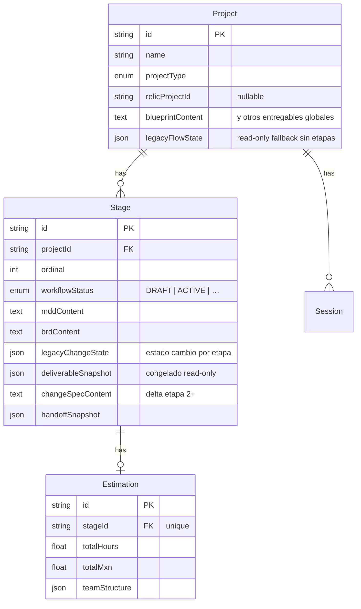

# Etapas (Stage) y SDD — modelo mental

**Propósito:** Una sola página con el mapa **Proyecto → Etapa → Constitución + coste → grafo Falkor**. Complementa [THEFORGE-INDEX.md](THEFORGE-INDEX.md) §7 y [MCP-ARQUITECTURA-THEFORGE.md](MCP-ARQUITECTURA-THEFORGE.md) §2 sin repetir Docker ni AriadneSpecs.

---

## 1. Por qué existe `Stage`

El **MDD** (Constitución SDD), el **semáforo** (`Status`: ROJO / AMARILLO / VERDE), **`precisionScore`** y la **estimación** (`Estimation`: horas, MXN, `teamStructure`) son entregables *constitucionales* que evolucionan por **fase de vida** (borrador MDD, impacto legacy, auditoría, etc.). Vivían en `Project` y pasaron a **`Stage`** (relación 1:N) para no monolitizar el proyecto: el resto de documentos (SPEC, Blueprint, API, Infra, …) siguen en `Project` como hoy.

---

## 2. Diagrama de datos (Prisma)

**Elección de etapa “en foco”:** la primera con `workflowStatus === ACTIVE` (menor `ordinal`); si ninguna, la de menor `ordinal`. Ver `pickPrimaryStage` en `apps/api/src/modules/projects/stage-helpers.ts`.

---

## 3. Entregables por etapa (`deliverableSnapshot`)

| Momento | Fuente snapshot | Campo `source` |
|---------|-----------------|----------------|
| Tras cascada `generate-deliverables` | Proyecto activo | `cascade` |
| Tras import/promote handoff | Proyecto tras handoff | `manual` |
| Al archivar / completar / superseded | Proyecto si faltaba | `manual` |
| Al activar etapa N (N>1) | Etapa anterior activa | `cascade` |

**Lectura:** `GET /projects/:id/stages/:stageId/deliverables` → `resolveStageDeliverables`. Etapas históricas (`readOnly: true`) sirven snapshot; etapa ACTIVE lee campos live de `Project`.

**Escritura:** Los generadores siguen persistiendo en `Project.*Content`; el snapshot congela una copia en hitos del ciclo de vida.

---

## 4. Gates brownfield (etapa 2+ legacy)

| Gate | Condición | API | Workshop |
|------|-----------|-----|----------|
| **Cambio descrito** | `legacyChangeState.description`, handoff importado, o `legacy/start` | `assertLegacyChangeGate` | Banner + disabled MDD |
| **Handoff integración** | Proyecto NEW enlazado + etapa 2+ sin `handoffImportedAt` | `LEGACY_INTEGRATION_HANDOFF_GATE=1` | Toggle strict + banner |

`legacyChangeState` es la **única escritura** de estado de cambio cuando existen etapas. `Project.legacyFlowState` queda como fallback de lectura (proyectos sin etapas) y para `codebaseDoc` AS-IS en etapa 1 hasta migración completa.

---

## 5. API REST y front

`GET /projects/:id` y `PATCH /projects/:id` **aplanan** sobre el objeto proyecto: `mddContent`, `status`, `precisionScore`, `estimation` — como si siguieran en `Project` — para no romper Workshop ni stores.

- **`PATCH`** opcional: `{ "stageId": "<uuid>" }` para escribir el MDD en otra etapa.
- **`PATCH /stages/:stageId`:** admite `workflowStatus` (COMPLETED, ARCHIVED, SUPERSEDED) → dispara snapshot si falta.
- Sin `stageId`: se usa la etapa en foco.

---

## 6. FalkorDB SDD (misma etapa)

La ingesta al grafo local usa el **mismo** `stageId` que el MDD persistido: nodos `Stage` / `LegacyStage`, `HandoffItem`, relaciones `DERIVED_FROM`, `INTEGRATES_WITH`, `SATISFIES`. Post-promote/import handoff: `syncHandoffItemsToStage`.

Consultas desde agentes: `params.projectId` **o** `params.stageId` (mínimo uno). Herramientas: `query_sdd_graph`, `supervisor_query_sdd_graph`, `patch_mdd_section`, `propose_mdd_amendment`. Detalle: [MCP-ARQUITECTURA-THEFORGE.md](MCP-ARQUITECTURA-THEFORGE.md).

---

## 7. Export spec-kit / OpenSpec

- **Spec-kit:** `GET /projects/:id/export/sdd-bundle`, `export/repo-handoff` — incluye `changeSpecContent` y `quickstart.md` derivado de criterios + delta.
- **OpenSpec parity:** `openspec/changes/{slug}/proposal.md`, `tasks.md`, micro-specs `openspec/handoff/NEW-LEG-xx.md`.
- **Ramas:** política `00N-{slug}` documentada en `IMPLEMENT.md` y `openspec/BRANCH-POLICY.md`.

---

## 8. Referencias rápidas

| Tema | Dónde |
|------|--------|
| Esquema Prisma actual | `packages/database/schema.prisma`, `blueprint.md` §2 |
| Migración datos | `packages/database/migrations/*stage_sdd*` |
| Snapshot util | `stage-deliverable-snapshot.util.ts` |
| Integración handoff | `project-integration.service.ts` |
| Plan P1–P3 | `docs/plans/PLAN-BROWNFIELD-P1-P2-P3.md` |

---

*Mantener alineado con el código; si cambia el contrato API de aplanado, actualizar §5.*

---

*Corpus «The Forge - by Kreo» — NotebookLM sync 2026-06-19.*
