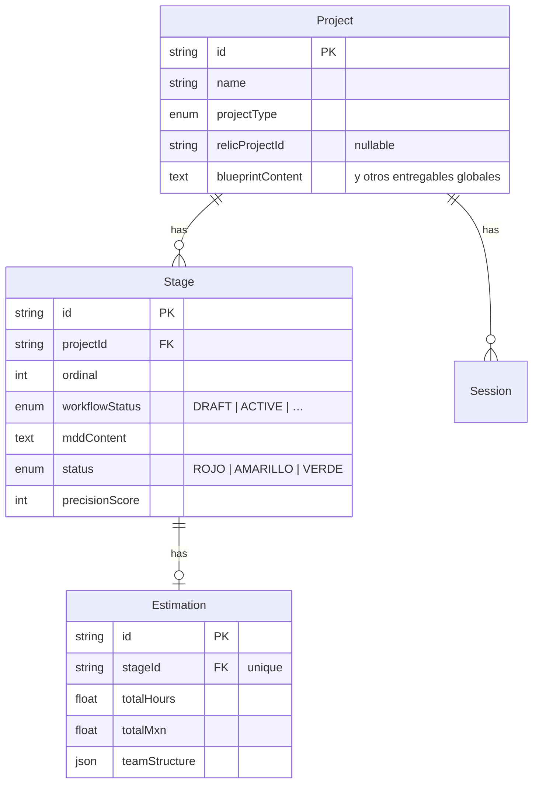

# Etapas (Stage) y SDD — modelo mental

**Propósito:** Una sola página con el mapa **Proyecto → Etapa → Constitución + coste → grafo Falkor**. Complementa [THEFORGE-INDEX.md](THEFORGE-INDEX.md) §7 y [MCP-ARQUITECTURA-THEFORGE.md](MCP-ARQUITECTURA-THEFORGE.md) §2 sin repetir Docker ni AriadneSpecs.

---

## 1. Por qué existe `Stage`

El **MDD** (Constitución SDD), el **semáforo** (`Status`: ROJO / AMARILLO / VERDE), **`precisionScore`** y la **estimación** (`Estimation`: horas, MXN, `teamStructure`) son entregables *constitucionales* que evolucionan por **fase de vida** (borrador MDD, impacto legacy, auditoría, etc.). Vivían en `Project` y pasaron a **`Stage`** (relación 1:N) para no monolitizar el proyecto: el resto de documentos (SPEC, Blueprint, API, Infra, …) siguen en `Project` como hoy.

---

## 2. Diagrama de datos (Prisma)

**Elección de etapa “en foco”:** la primera con `workflowStatus === ACTIVE` (menor `ordinal`); si ninguna, la de menor `ordinal`. Ver `pickPrimaryStage` en `apps/api/src/modules/projects/stage-helpers.ts`.

---

## 3. API REST y front

`GET /projects/:id` y `PATCH /projects/:id` **aplanan** sobre el objeto proyecto: `mddContent`, `status`, `precisionScore`, `estimation` — como si siguieran en `Project` — para no romper Workshop ni stores.

- **`PATCH`** opcional: `{ "stageId": "<uuid>" }` para escribir el MDD en otra etapa.
- Sin `stageId`: se usa la etapa en foco.

---

## 4. FalkorDB SDD (misma etapa)

La ingesta al grafo local usa el **mismo** `stageId` que el MDD persistido: nodos `Stage`, `MDD_Section`, `DB_Entity`, `API_Endpoint`, relaciones `IMPLEMENTS`, `CONSUMES`, etc. Variables: `FALKORDB_SDD_URL` / `FALKORDB_URL`.

Consultas desde agentes: `params.projectId` **o** `params.stageId` (mínimo uno). Herramientas: `query_sdd_graph`, `supervisor_query_sdd_graph`, `patch_mdd_section`, `propose_mdd_amendment`. Detalle: [MCP-ARQUITECTURA-THEFORGE.md](MCP-ARQUITECTURA-THEFORGE.md).

---

## 5. Referencias rápidas

| Tema | Dónde |
|------|--------|
| Esquema Prisma actual | `packages/database/schema.prisma`, `blueprint.md` §2 |
| Migración datos | `packages/database/migrations/*stage_sdd*` |
| Servicio que aplanará respuestas | `ProjectsService` (`apps/api/src/modules/projects/`) |
| Supervisor / ruta agéntica | `AgentSupervisorService`, `activeStageId` en estado MDD |

---

*Mantener alineado con el código; si cambia el contrato API de aplanado, actualizar §3.*

---

*Corpus «The Forge - by Kreo» — NotebookLM sync 2026-06-10 (pnpm). Rutas relativas al monorepo `theforge`.*
