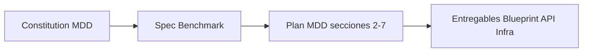

# TheForge — Índice de Arquitectura

**Fuentes:** `blueprint.md`, `mdd.md`, [STAGE-SDD.md](STAGE-SDD.md) (Stage / Prisma / Falkor SDD).  
**Propósito:** Single source of truth del flujo, contrato IA y despliegue. Uso por el agente y por implementaciones.

---

## 1. Flujo de TheForge (resumen)

```
[Entrada] → Entrevista proactiva (IA) → MDD en sesión → Semáforo → [ROJO|AMARILLO|VERDE]
                                                                         ↓
[VERDE]   → Motor de estimación (MXN/h) → Entregables: MDD, Blueprint, OpenAPI, Scaffold
```

- **Entrevista:** Trabajo asíncrono; cada interacción persiste en `Session.chatLog`; la IA retoma por `contextStep` y log.
- **Semáforo:** Valida el JSON del proyecto (entidades, business_core, edge_cases, field_types, mapeo UX). Ver §4.
- **Estimación:** Fórmula fija (no IA). Ver §5.
- **Entregables:** Solo cuando estado = VERDE: Master Design Doc, Implementation Blueprint, OpenAPI Spec, Project Scaffold + `.cursorrules`.
- **MDD como Constitución (SDD):** El MDD es el documento "Constitución" del proyecto (Source of Governance en Specification-Driven Development). Todos los entregables (Blueprint, OpenAPI, Scaffold) deben adherirse a él y validarse contra él antes de considerarse listos.



**Spec antes del MDD:** Spec = Benchmark + clarifiedScope. Es el paso explícito antes de cerrar el MDD; el Clarifier usa el Spec (si está presente) para §1. Revísalo en la pestaña Spec antes de dar por cerrado el MDD.

**Estructura MDD:** El MDD tiene exactamente 7 secciones: 1. Contexto, 2. Arquitectura y Stack, 3. Modelo de Datos, 4. Contratos de API, 5. Lógica y Edge Cases, 6. Seguridad, 7. Infraestructura. Semáforo y estimador dependen de esta numeración.

**Validación SDD:** Ver [Entregables y validación SDD](ENTREGABLES-SDD-VALIDACION.md) para la estructura canónica del MDD, el mapeo de documentos (Guía UX/UI, Blueprint, API, Flujos, Infra) con Specification-Driven Development y Architecting Agentic Systems. **Plan 10/10:** mismo doc §6 (plan por fases). §7 estado de implementación: Spec, Tasks, Conformance, Verifier, HITL y orden en UI implementados.

**MCP AriadneSpecs vs Grafo SDD:** El MCP **AriadneSpecs** (código indexado del cliente) es **externo** al monorepo The Forge y se invoca por HTTP desde la API (`THEFORGE_MCP_URL`, JSON-RPC Streamable HTTP). Especificación del servidor: monorepo **Ariadne** (`MCP_HTTPS.md`, `mcp_server_specs.md`, `MCP_AYUDA.md`). El grafo documental SDD vive en **FalkorDB local** (`FALKORDB_SDD_URL`). No son intercambiables. Detalle: [MCP-ARQUITECTURA-THEFORGE.md](MCP-ARQUITECTURA-THEFORGE.md), [integracion-theforge/README.md](integracion-theforge/README.md). Histórico / roadmaps no prioritarios: [../archive/README.md](../archive/README.md).

**Flujo Workshop agéntico:** Chat → `AgentSupervisor` (etapa activa `Stage`) → ingest MDD a Falkor SDD por `stageId` → evaluador legacy opcional → respuesta puede incluir `evaluatorCritique`. Memoria episódica: `GET /agent-supervisor/episodic/:projectId`. **API REST:** `GET/PATCH /projects/:id` devuelve y acepta `mddContent` / `status` / `precisionScore` / `estimation` **aplanados** desde la etapa principal; `PATCH` admite `stageId` opcional para escribir el MDD en otra etapa.

---

## 2. Estructura del monorepo (Turborepo)

```
/
├── apps/
│   ├── api/          # NestJS
│   └── web/          # React (Vite) + Tailwind
├── packages/
│   ├── database/       # Prisma schema + client
│   ├── shared-types/   # DTOs e interfaces
│   ├── business-rules/ # Reglas puras compartidas (estimación MXN, parse infra)
│   └── config/         # TS, ESLint, Tailwind
├── docker-compose.yml
├── turbo.json
└── .cursor/rules/
```

---

## 3. IA agnóstica (OpenAI / Gemini)

### 3.1 Contrato del proveedor (adapters)

La capa de **adapters** implementa una interfaz técnica común. No debe haber imports de `openai` o `@google/generative-ai` fuera de `apps/api/src/modules/ai/adapters/`.

**Interfaz mínima (blueprint):**

- `generateResponse(prompt: string, history: Array<{role, content}>): Promise<string>`
- `parseChecklist(text: string): Promise<ChecklistResult>`

**Capacidades de negocio (MDD) construidas sobre el contrato:**

- `entrevistar()` → uso de `generateResponse` + persistencia en Session.
- `analizarContexto()` → idem.
- `generarBlueprint()` → idem + posible uso de `parseChecklist`.

### 3.2 Reglas de implementación

| Regla             | Detalle                                                                                                               |
| ----------------- | --------------------------------------------------------------------------------------------------------------------- |
| **Strategy**      | `LLMProvider` (o nombre equivalente) como interfaz; `OpenAIAdapter` y `GeminiAdapter` como implementaciones.          |
| **Configuración** | Un solo punto: `process.env.AI_PROVIDER` (`openai` \| `google`). Sin branching por proveedor en servicios de negocio. |
| **Factory**       | Clase/función que devuelve la instancia del adapter según `AI_PROVIDER`. Inyectada en Nest (DI).                      |
| **Resiliencia**   | try/catch y logs estructurados en todas las llamadas a los adapters (regla en architect-behavior).                    |

### 3.3 Variables de entorno por proveedor

- **OpenAI-compatible:** `AI_API_KEY` (alias `OPENAI_API_KEY`) y opcionalmente modelo (`OPENAI_CHAT_MODEL`, etc.).
- **Google:** `GOOGLE_GENERATIVE_AI_API_KEY` (y opcionalmente modelo).
- **Común:** `AI_PROVIDER`.

Nada de lógica acoplada a un proveedor fuera de `adapters/` y del factory.

---

## 4. Semáforo del MDD

Servicio en backend (`SemaphoreService`) que combina **complejidad del proyecto** (`ComplexityLevel`), **entregables** (LOW/MEDIUM) y **JSON normalizado del MDD** de la **etapa activa** (`normalizeMddContent` → string JSON con `db_entities`, `business_core`, `edge_cases`, `field_types`, opcionalmente `constitution`). El API expone el MDD también como campos de primer nivel del proyecto por compatibilidad.

### 4.1 Por complejidad

| Nivel   | Resumen |
| ------- | ------- |
| **LOW** | Historias de usuario + tareas sustanciales; Figma si `hasUxTeam`. |
| **MEDIUM** | Cinco gates: spec o casos de uso, contratos API, guía UX **o** flujos, **historias de usuario**, tareas. Los cinco cumplidos → VERDE (~95); 3–4 → AMARILLO (~70); menos → ROJO. |
| **HIGH** | Ver §4.2. |

### 4.2 HIGH (MDD canónico + alivio de grafo + Constitución Cursor)

| Estado       | Condición (orden conceptual) |
| ------------ | ---------------------------- |
| **ROJO**     | Sin JSON válido; o sin entidades / sin `business_core` sustancial. |
| **AMARILLO** | Hay entidades y núcleo de negocio pero faltan `edge_cases` o `field_types` **y** no hay alivio de grafo SDD; o falta Figma con equipo UX (~85); o incumplen puertas **Constitución Cursor** cuando `constitution.template_detected` (mapa de contextos, glosario, Gherkin §5, bloqueantes abiertos, «¿Por qué?»/ADR en §2 — ver `semaphore.service.ts`). |
| **VERDE**    | Checklist MDD completo y Figma si aplica (~95). **O** faltan textos edge/field pero el **Grafo SDD** (Falkor) no reporta dependencias huérfanas entre endpoint de API y entidad de dominio (`sddDomainGraphOk`) → VERDE con precisión **92** (The Forge conserva esta señal frente a solo MaxPrime). |

Las puertas de constitución **no** sustituyen ROJO por entidades vacías; pueden bajar un VERDE (p. ej. 95 o 92) a AMARILLO si la plantilla §1–§5 está incompleta. Si el resultado base ya es AMARILLO con score más bajo que el de constitución, se conserva el más estricto.

El agente debe comprobar estado VERDE antes de generar código (architect-behavior).

---

## 5. Motor de estimación (MXN, México 2026)

- **Fórmula (detalle en código):** horas base = entidades×12 + pantallas×16 + endpoints extra×4; multiplicadores por etiquetas `TechnicalMetadata`; horas fijas (metadata + sección infra); si el semáforo **no** es VERDE, buffer **1.25**; **total MXN** = horas totales × **$1 050/h** (tarifa única del estimador). Las cifras **Architect $1 500, Back $950, Front $850, UX $750** son referencia por rol / vista de equipo (mismo paquete).
- **Fuente única de verdad:** `packages/business-rules` (`computeCostEstimation`, constantes y multiplicadores). El servicio Nest `CostCalculatorService` delega allí; el front (`apps/web/src/utils/costCalculator.ts`) importa el mismo paquete para el panel del Workshop.
- **Lógica pura; no IA.** No alterar fórmulas ni tarifas sin acuerdo explícito y sin actualizar este índice.

---

## 6. Despliegue Dokploy (Docker)

### 6.1 Servicios (`docker-compose.yml` en la raíz)

| Servicio                 | Rol                                                                 | Imagen / build                          |
| ------------------------ | ------------------------------------------------------------------- | --------------------------------------- |
| **theforge-db**          | PostgreSQL                                                          | `postgres:15-alpine`                    |
| **theforge-redis-queue** | **Redis dedicado a BullMQ** (cola de cascada `generate-deliverables`; obligatorio en el stack documentado) | `redis:7-alpine`                        |
| **theforge-falkor-sdd**  | Grafo documental SDD (Cypher, MDD, ingest); **no** es el grafo índice de código TheForge | `falkordb/falkordb:latest`              |
| **theforge-api**         | NestJS API                                                          | Build multi-stage `apps/api/Dockerfile` |
| **theforge-web**         | Front estático                                                      | Build `apps/web/Dockerfile` (Nginx)     |

**Importante:** Hay **dos** usos de protocolo Redis en el stack: (1) **FalkorDB** para el grafo SDD (`FALKORDB_SDD_URL`); (2) **Redis de cola** para **BullMQ** (`REDIS_URL` → `theforge-redis-queue`). No son intercambiables. En despliegue oficial, **BullMQ + Redis de cola son obligatorios** para entregables asíncronos resilientes (evitar timeouts HTTP en cascadas largas); vaciar `REDIS_URL` fuerza fallback síncrono solo para desarrollo excepcional.

### 6.2 Variables de entorno (api) — resumen

- **Core:** `DATABASE_URL`, `PORT` (opcional)
- **Cola asíncrona (obligatorio en stack Dokploy/compose de referencia):** `REDIS_URL` (p. ej. `redis://theforge-redis-queue:6379`) para **BullMQ**
- **IA:** `AI_PROVIDER`, `AI_API_KEY` (alias `OPENAI_API_KEY`) / `GOOGLE_GENERATIVE_AI_API_KEY`, opcional `OPENAI_EMBEDDING_DIM`
- **Grafo SDD:** `FALKORDB_SDD_URL` y/o `FALKORDB_URL` (en Docker: `redis://theforge-falkor-sdd:6379`) — **distinto** del Redis de cola
- **TheForge (opcional, legacy):** `THEFORGE_MCP_URL`, `MCP_AUTH_TOKEN`, `THEFORGE_MCP_TIMEOUT_MS`
- **Orquestador:** `AGENT_EVALUATOR_LEGACY` (opcional; crítica en respuesta chat)

Detalle TheForge vs IDE vs Falkor: [MCP-ARQUITECTURA-THEFORGE.md](MCP-ARQUITECTURA-THEFORGE.md).

### 6.3 Criterios "Dokploy-ready"

- **docker-compose.yml:** servicios anteriores; volúmenes para Postgres, Falkor SDD y **Redis de cola** (`theforge_redis_queue_data`).
- **Builds:** `api` y `web` multi-stage; sin depender del host.
- **Healthchecks** en `docker-compose` para `db`, `falkor-sdd`, `api`, `web`.

Cualquier nuevo servicio o variable debe reflejarse en `docker-compose.yml` y en `.env.example`.

---

## 7. Base de datos (Prisma)

Modelos principales: **Project** (entregables globales: SPEC, Blueprint, API, Infra, etc.; sin MDD monolítico), **Stage** (`mddContent`, semáforo `status`, `precisionScore`, `workflowStatus`, `estimation` 1:1), **Session** (`chatLog`, `contextStep`). **Estimation** cuelga de **Stage** (`stageId`). Enum **Status** (semáforo SDD): ROJO, AMARILLO, VERDE. Resumen visual y API: [STAGE-SDD.md](STAGE-SDD.md). Detalle Prisma en `blueprint.md` §2 y migración `packages/database/migrations/*stage_sdd*`.

---

## 8. Checklist de verificación (Principal Engineer)

- [ ] IA: Solo `AI_PROVIDER` + factory; adapters solo en `ai/adapters/`; sin `openai`/`gemini` en servicios.
- [ ] Semáforo: Reglas ROJO/AMARILLO/VERDE implementadas y usadas antes de generar código.
- [ ] Estimación: Fórmula y tarifas únicas en `packages/business-rules` (consumidas por API y web).
- [ ] Docker: `docker-compose` con api, web, db, **Redis cola (BullMQ)**, Falkor SDD; Dockerfiles multi-stage; env documentados (`.env.example`).
